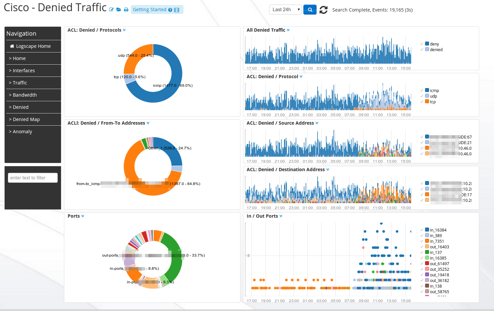

# CiscoApp-1.0 

Monitor Cisco ASA and PIX family devices in a few quick easy step

## Overview 

 The CiscoApp contains 4 main workspaces to give your insight into your network traffic

	* Home - Overview of Syslog Messages 
	* Traffic - Charts that help with the analysis of incoming and out going connections
	* Interface - A break down of your messages by interface type
	* Bandwidth - Address, Protocol and Port views of bandwidth utilization 

 

## Downloads

* [Cisco App](https://github.com/logscape/ciscoapp/raw/master/dist/CiscoApp-1.1.zip)

### Using Logscape Syslog Server 
The Logscape Manager runs a Syslog server on these ports 

	tcp MANAGER:1468
	udp MANAGER:1514

Set up your Cisco ASA device to the Logscape Syslog Server. 
Logscape Syslog Server will collect and store your Cisco data in the following location

	$LOGSCAPE_HOME/work/Syslog_Server/device.hostname.local/*

### Modify your Syslog Server Data Source

In this step you will need to update your syslog-server data sources. Add the tag to your data source

	cisco-asa 

This tag identifies your Syslog data as Cisco Syslog messages. 

  

